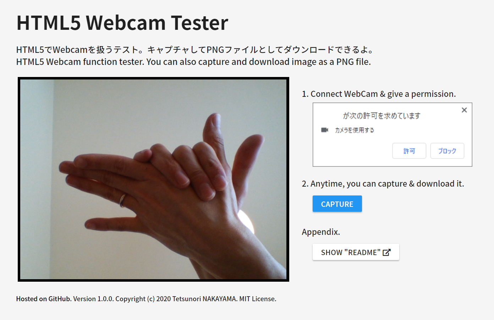
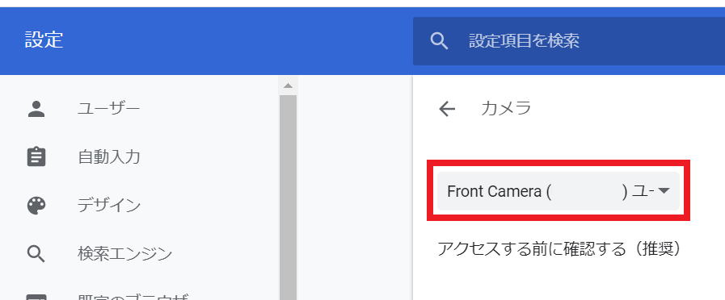

# HTML5 Webcam Tester
Version 1.2.0  

# Description
HTML5 Webcam function tester. You can also capture and download image as a PNG file.  
See [this article](https://qiita.com/tetunori_lego/items/4d0da075224abbaa4389) in detail. You can try [here](https://tetunori.github.io/HTML5WebcamTester/).

# Usage
1. Connect WebCam to your PC.
2. Open [this tool](https://tetunori.github.io/HTML5WebcamTester/). Google Chrome is highly recommended.
3. Give a permission. Press "Allow"/"許可" on the dialog below.
 
4. Press "Capture" button after the video streaming started. Captured image will be downloaded instantly.
5. Press "Flip Camera" icon upper left on the video region, then you can switch camera(especially for smart devices).

## Supplement
If you have multiple cameras in PC, you can switch to another camera in the following steps.
1. Press a 'Camera' icon next to the URL, then press 'Manage/管理' button.
 
2. Select a camera you would like to use in the Chrome camera setting.
 

# Licence
This software is released under the MIT License, see LICENSE.

# Author
Tetsunori NAKAYAMA.

# References
On HTML5 video tag  
https://developer.mozilla.org/ja/docs/Web/HTML/Element/video

jsQR @cozmo
https://github.com/cozmo/jsQR

Capturing image from video streaming  
https://qiita.com/iwaimagic/items/1d16a721b36f04e91aed

YYYYMMDD hhmmss  
https://gist.github.com/froop/962669

Icon  
https://material.io/resources/icons/

UI parts  
https://www.muicss.com/
